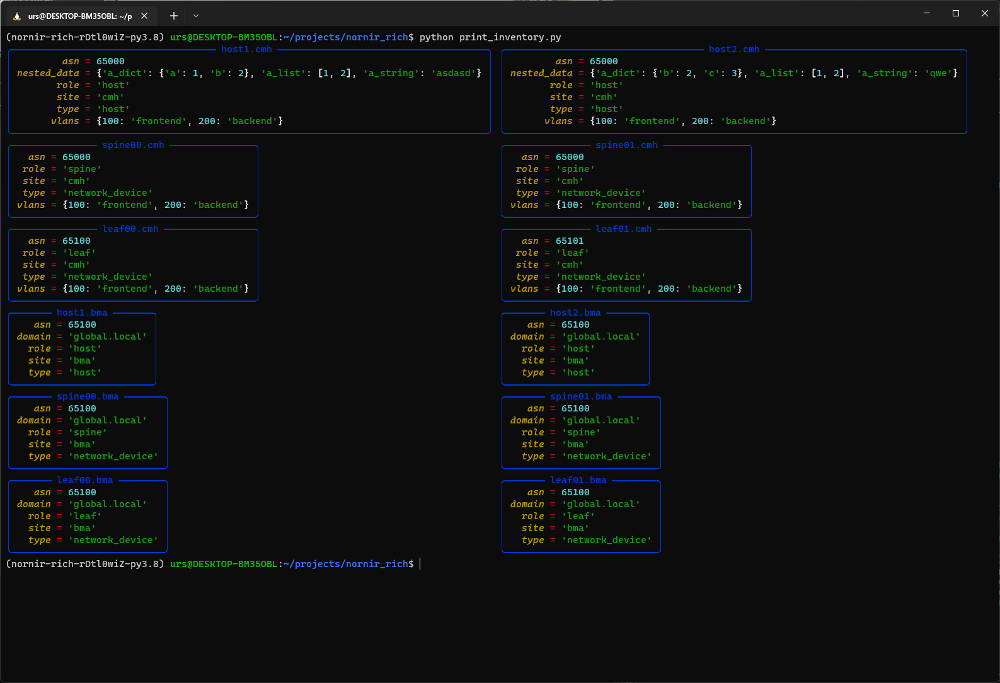
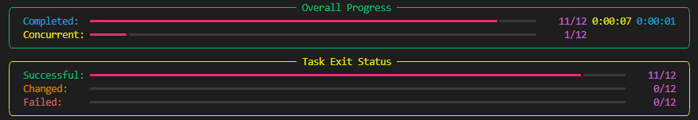

# nornir_rich

## Install

```bash
pip install nornir-rich
```

## Usage

Features

- Print functions
  - `print_result`
  - `print_failed_hosts`
  - `print_inventory`
- Processors
  - `progressbar`


### Print example

```python
from nornir_rich.functions import print_result

results = nr.run(
    task=hello_world
)

print_result(results)
print_result(results, vars=["diff", "result", "name", "exception", "severity_level"])
```

### Progress bar example

```python
from time import sleep
from nornir_rich.progress_bar import RichProgressBar


def random_sleep(task: Task) -> Result:
    delay = randrange(10)
    sleep(delay)
    return Result(host=task.host, result=f"{delay} seconds delay")


nr_with_processors = nr.with_processors([RichProgressBar()])
result = nr_with_processors.run(task=random_sleep)
```


## Images

### Print Inventory



### Print Result


### Progress Bar




More [examples](docs/print_functions.ipynb)