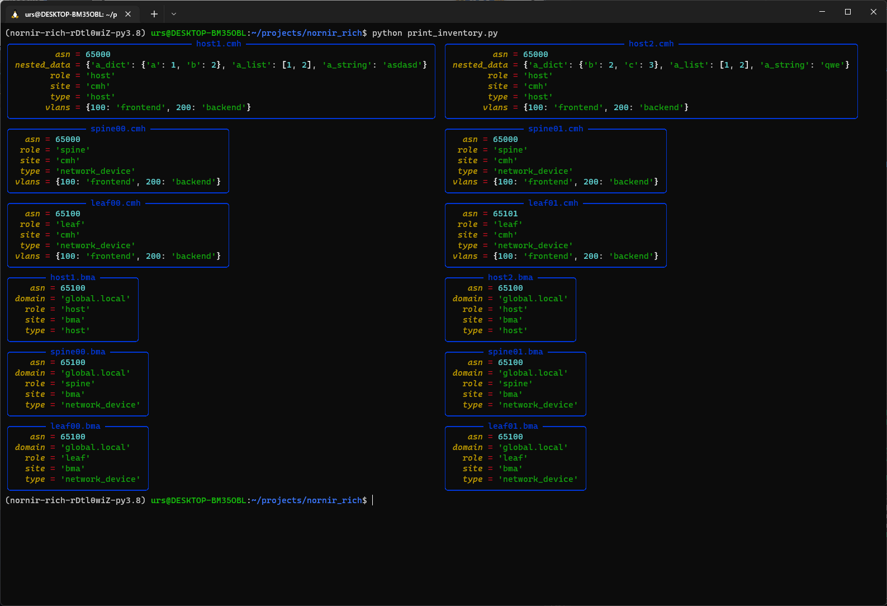
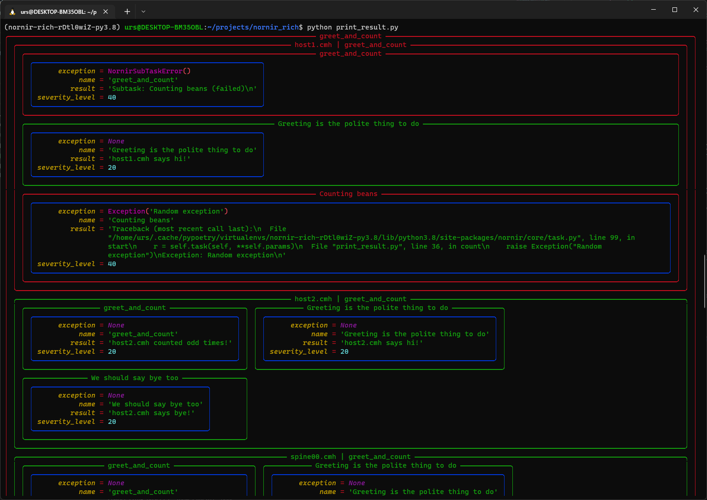
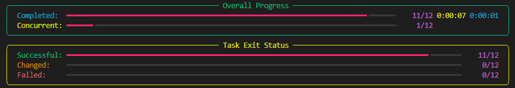

# nornir_rich

## My branch (per_panel_var)

Adds a few extra options to the *print_result* method:

- *empty_var* (default True): Do not print any empty *result vars*, it also doesn't print the task if *result* is empty
- *per_panel_var* (default False): Puts each *result var* in its own *rich panel*, if the var is a dictionary rather than having result as the key uses key for each dictionary item (all displayed in the one panel)

```python
print_result(
    results,
    vars=["name", "result"],
    empty_var=False,
    per_panel_var=True,
)
```

To install this branch:

```bash
pip install git+https://github.com/sjhloco/nornir_rich@per_panel_var
```

## Install

```bash
pip install nornir-rich
```

## Usage

Features

- Print functions
  - `print_result`
  - `print_failed_hosts`
  - `print_inventory`
- Processors
  - `progressbar`


### Print example

```python
from nornir_rich.functions import print_result

results = nr.run(
    task=hello_world
)

print_result(results)
print_result(results, vars=["diff", "result", "name", "exception", "severity_level"])
```

### Progress bar example

```python
from time import sleep
from nornir_rich.progress_bar import RichProgressBar


def random_sleep(task: Task) -> Result:
    delay = randrange(10)
    sleep(delay)
    return Result(host=task.host, result=f"{delay} seconds delay")


nr_with_processors = nr.with_processors([RichProgressBar()])
result = nr_with_processors.run(task=random_sleep)
```


## Images

### Print Inventory



### Print Result



### Progress Bar




More [examples](docs/imgs/print_functions.ipynb)
